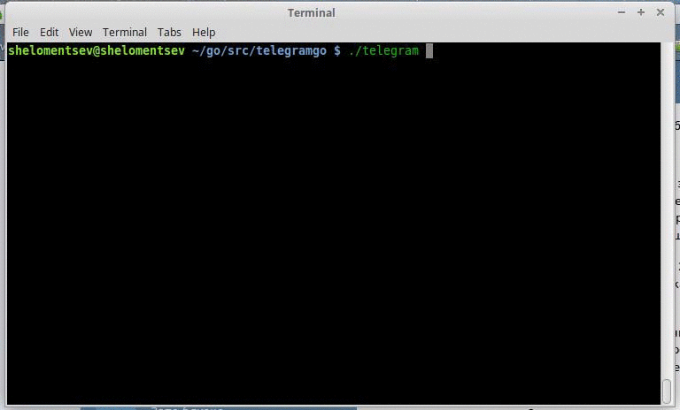

# Telegram messenger CLI

Command-line interface for Telegram. Uses readline interface.

# Build
## Dependencies
[MTProto](https://github.com/shelomentsevd/mtproto) - library for working with Telegram API
## Release
make
## Debug
make debug

# Commands
Press CTRL-C to input command.
Availables commands:
* \me - shows information about current account
* \contacts - shows contacts list
* \umsg <id> <message> - sends message to user with <id> 
* \cmsg <id> <message> - sends message to chat with <id>
* \help - shows available commands
* \quit - quit from program
# English Documentation
* coming shortly

# Note for Russian Speaking users

## Библиотека для работы с Telegram API на Go
В отличии от API для создания ботов, Telegram API для мессенджеров почти не имеет актуальных библиотек. Как на других языках, так и на Go.

Если вам надо написать архиватор сообщений из супергрупп и каналов Telegram'a,вы попали в правильное место. 

### Библиотека
Большая часть кода позаимствована из http://github.com/sdidyk/mtproto . 
### Отличия:
* последняя версия Telegram API
* автоматическое переподключение к серверу после сброса соединения
* возможность сериализовать данные полученные из Telegram'a в JSON
* исправлены ошибки предыдущей библиотеки
### Кодогенерация 
Большая часть кода генерируется спомощью простого скрипта на Python, который выполняет трансляцию из TL(о нем ниже) в Go. В дальнейшем, будут генерироваться не только структуры на Go и методы их сериализации/десереализации из бинарного кода, а ещё функции для вызова процедур API. 
https://github.com/shelomentsevd/mtproto

### О Telegram API и проблемах с документацией
Telegram для обмена данными между сервером и клиентом использует RPC протокол, который описывается через TL-схему. Язык TL(Type Language or Time Limit) описывает как данные будут сериализоваться в бинарный код или десериализовываться из него. 
Например вот так выглядит описание чата из 23-ей версии схемы Telegram API:
```
chat#6e9c9bc7 id:int title:string photo:ChatPhoto participants_count:int date:int left:Bool version:int = Chat;
```
В самом начале пакета идет 4 байта безнакового числа, которые служат индетификатором процедуры или объекта, по ним сервер или клиент догадывается что это и какие данные будут следующими. В нашем случае это "6e9c9bc7". Дальше идут поля структуры в том порядке в каком они записаны в TL-схеме. Подробнее о том как работает протокол и сериализация можно прочитать здесь: https://core.telegram.org/mtproto/TL

К сожалению, на core.telegram.org вы не найдете актуальной версии TL-схемы Telegram API и документации к ней, а только описание языка и работы самого протокола.

### Язык
* https://core.telegram.org/mtproto/TL - Описание языка TL
* https://github.com/telegramdesktop/tdesktop/blob/dev/Telegram/Resources/scheme.tl - самая свежая версия TL-схемы можно найти здесь.
### Примеры работы с Telegram API
* https://github.com/telegramdesktop/tdesktop - Десктопный клиент Telegram'a. Язык C++. 
* https://github.com/DrKLO/Telegram - Android клиент. Часть кода работы с API написана на С++, часть на Java.
* https://github.com/QtGram/LibQTelegram - QT библиотека для работы с Telegram API. Язык C++.
* https://github.com/sdidyk/mtproto - Отсюда я позаимствовал большую часть кода. Язык Go.
* https://github.com/zerobias/telegram-mtproto - Библиотеки для JavaScript'a. 

# Contacts
Feel free to ping me in Telegram or drop me email. If you are in Moscow, feel free to invite me for coffee or quick chat in your office ;)))
* Email: shelomentsev@protonmail.com
* Telegram: @shelomentsevd
# License
MIT
